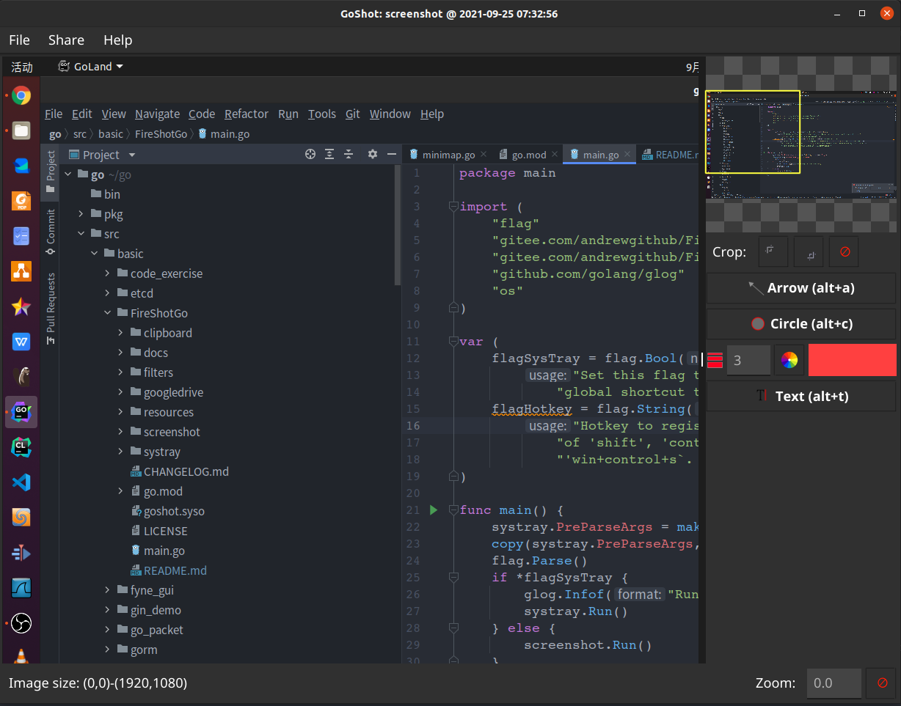

[](https://gitee.com/andrewgithub/FireShotGo)

[TOC]

# `FireShotGo`

## 项目简介

`FireShotGo`是使用`fyne`实现的一个跨平台截图软件

对于`Fyne`陌生的同学可以参考 [`fyne club`](https://gitee.com/andrewgithub/fyne-club)上面已经实现了详细的文档和对应每小节对应的源码

## 安装信息

### Linux

在`Linux`上需要安装`gtk`库，以及依赖的库

`ubuntu`上可以使用如下命令安装

```bash
sudo apt-get install libappindicator3-dev -y
sudo apt-get install libgtk-3-dev
```


### `Windows`

在`windows`上需要安装配置`MinGW`环境，并配置`go`语言开发环境


## 历史版本

### `v1.0.0`

主要功能，实现截图的基本功能，能够绘制箭头，绘制椭圆型标记，添加文本的基本功能



**功耗**

在八核的`ubuntu`及机器上，一般占用`CPU`5.9左右

### `v1.0.1`

添加中文注释

该版本没有新增功能，主要是对原有的逻辑添加中文注释，并迁移到`gitee`上，方便后期团队开发


## `TODO`


- 增加虚线功能
- 增加矩形框功能


