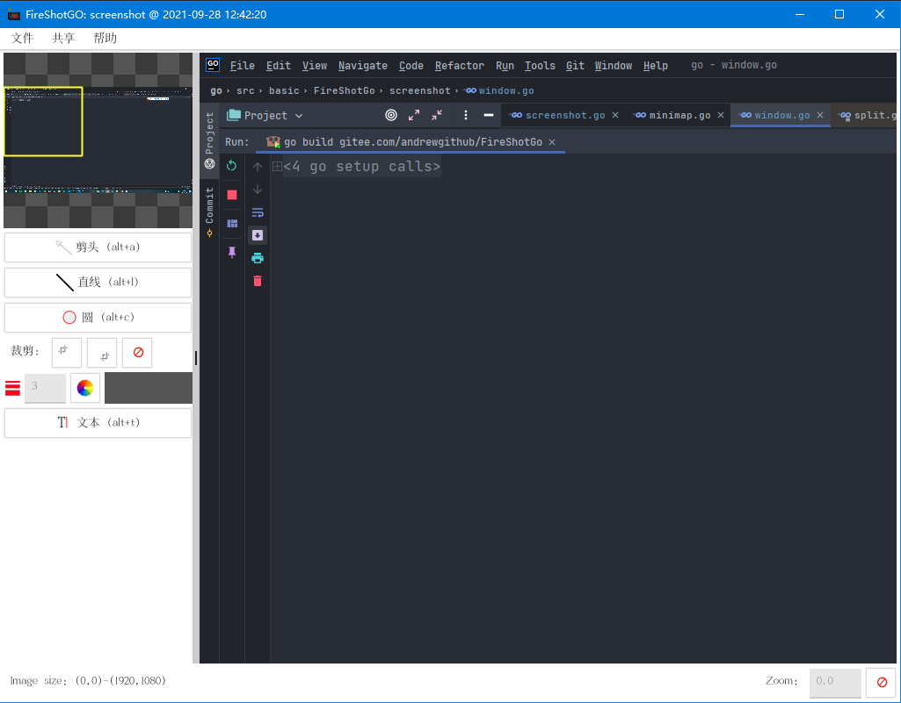

[](https://gitee.com/andrewgithub/FireShotGo)

[TOC]

# `FireShotGo`

## 项目简介

`FireShotGo`是使用`fyne`实现的一个跨平台截图软件

对于`Fyne`陌生的同学可以参考 [`fyne club`](https://gitee.com/andrewgithub/fyne-club)上面已经实现了详细的文档和对应每小节对应的源码

## 安装信息

### Linux

在`Linux`上需要安装`gtk`库，以及依赖的库

`ubuntu`上可以使用如下命令安装

```bash
sudo apt-get install libappindicator3-dev -y
sudo apt-get install libgtk-3-dev
```


### `Windows`

在`windows`上需要安装配置`MinGW`环境，并配置`go`语言开发环境


## 历史版本

### `v1.0.0`

主要功能，实现截图的基本功能，能够绘制箭头，绘制椭圆型标记，添加文本的基本功能

**功耗**

在八核的`ubuntu`及机器上，一般占用`CPU`5.9左右

### `v1.0.1`

- 添加中文注释
- 该版本没有新增功能，主要是对原有的逻辑添加中文注释，并迁移到`gitee`上，方便后期团队开发

具体方式，下载中文字体，并将对应字体通过`fyne`工具生成静态资源文件，在通过主题的`Font`接口返回

### `v1.0.2`

- 支持中文，标题全部按照中文显示
- 更换为左边状态栏，更符合国人使用习惯



```go
fyne bundle xxxxx.ttf > bundle.go
```

比如我们这里使用中文字体实现的一个主题

```go
package firetheme

import (
	"fyne.io/fyne/v2"
	"fyne.io/fyne/v2/theme"
	"image/color"
)

type ShanGShouJianSongTheme struct{}

//var _ fyne.Theme = (*ShanGShouJianSongTheme)(nil)

// Font 返回的就是字体名
func (m ShanGShouJianSongTheme) Font(s fyne.TextStyle) fyne.Resource {
	return resourceShangShouJianSongXianXiTi2Ttf
}

func (*ShanGShouJianSongTheme) Color(n fyne.ThemeColorName, v fyne.ThemeVariant) color.Color {
	return theme.DefaultTheme().Color(n, v)
}

func (*ShanGShouJianSongTheme) Icon(n fyne.ThemeIconName) fyne.Resource {
	return theme.DefaultTheme().Icon(n)
}

func (*ShanGShouJianSongTheme) Size(n fyne.ThemeSizeName) float32 {
	return theme.DefaultTheme().Size(n)
}

```

### `v1.0.2`

- 支持鼠标截图

需要robot的支持，安装如果在Linux上安装robot需要安装`xcb`库，可以使用查找相关的库，并进行安装

```bash
sudo apt-cache search xcb
```

> ```go
> package main
> 
> import (
> 	"fmt"
> 
> 	"github.com/go-vgo/robotgo"
> )
> 
> func main() {
>   x, y := robotgo.GetMousePos()
>   fmt.Println("pos: ", x, y)
> 
>   color := robotgo.GetPixelColor(100, 200)
>   fmt.Println("color----", color)
> }
> ```


## `TODO`


- 增加虚线功能
- 增加矩形框功能
- 支持鼠标截图功能


