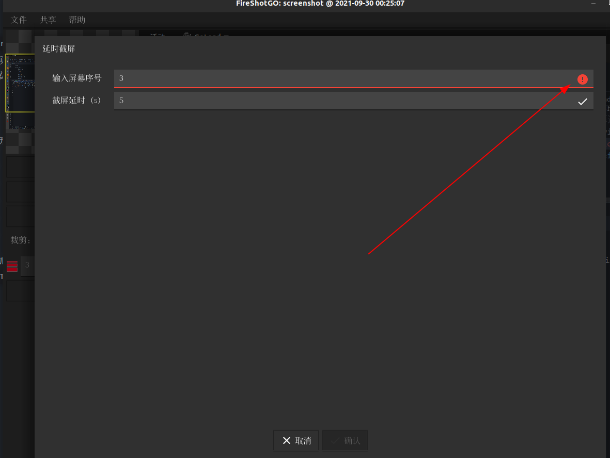

[](https://gitee.com/andrewgithub/FireShotGo)

[TOC]

# `FireShotGo`

## 项目简介

`FireShotGo`是使用`fyne`实现的一个跨平台截图软件

对于`Fyne`陌生的同学可以参考 [`fyne club`](https://gitee.com/andrewgithub/fyne-club)上面已经实现了详细的文档和对应每小节对应的源码

在线文档点击：[`FireShotGoDoc`](https://pkg.go.dev/gitee.com/andrewgithub/FireShotGo)

 分部详细教程：[`fyne club`](https://gitee.com/andrewgithub/fyne-club)

## 安装信息

### Linux

在`Linux`上需要安装`gtk`库，以及依赖的库

`ubuntu`上可以使用如下命令安装

```bash
sudo apt-get install libappindicator3-dev -y
sudo apt-get install libgtk-3-dev
```

### `Windows`

在`windows`上需要安装配置`MinGW`环境，并配置`go`语言开发环境

### 使用库

请确保本地的go的`SDK`版本是1.16或以上，否则不支持`//go:embed`语法

想按照库使用仅仅需要执行如下语句`go get gitee.com/andrewgithub/FireShotGo`即可将源码安装到本地，如果想在本地开发，可以直接使用git拉取仓库使用。


## 历史版本

### `v1.0.0`

主要功能，实现截图的基本功能，能够绘制箭头，绘制椭圆型标记，添加文本的基本功能

**功耗**

在八核的`ubuntu`及机器上，一般占用`CPU`5.9左右

### `v1.0.1`

- 添加中文注释
- 该版本没有新增功能，主要是对原有的逻辑添加中文注释，并迁移到`gitee`上，方便后期团队开发

具体方式，下载中文字体，并将对应字体通过`fyne`工具生成静态资源文件，在通过主题的`Font`接口返回

### `v1.0.2`

- 支持中文，标题全部按照中文显示
- 更换为左边状态栏，更符合国人使用习惯


```go
fyne bundle xxxxx.ttf > bundle.go
```

比如我们这里使用中文字体实现的一个主题

```go
package firetheme

import (
	"fyne.io/fyne/v2"
	"fyne.io/fyne/v2/theme"
	"image/color"
)

type ShanGShouJianSongTheme struct{}

//var _ fyne.Theme = (*ShanGShouJianSongTheme)(nil)

// Font 返回的就是字体名
func (m ShanGShouJianSongTheme) Font(s fyne.TextStyle) fyne.Resource {
	return resourceShangShouJianSongXianXiTi2Ttf
}

func (*ShanGShouJianSongTheme) Color(n fyne.ThemeColorName, v fyne.ThemeVariant) color.Color {
	return theme.DefaultTheme().Color(n, v)
}

func (*ShanGShouJianSongTheme) Icon(n fyne.ThemeIconName) fyne.Resource {
	return theme.DefaultTheme().Icon(n)
}

func (*ShanGShouJianSongTheme) Size(n fyne.ThemeSizeName) float32 {
	return theme.DefaultTheme().Size(n)
}

```

### `v1.0.3`

- 支持等宽直线功能


### `v1.0.4`

支持文本的中文输入


### `V1.0.5`

- 支持指定屏幕截屏

    指定屏幕从序号1开始，比如，需要1时主屏幕，序号二十分屏幕，因为多余两个屏幕的没发验证，目前输入框中限定只能输入1或者2，如果有多余两个屏幕的使用者需要将如下代码中正则匹配放开限制，比如将[1,2] – > [1-3]支持3号屏幕

    ```go
    selectEntry.Validator = validation.NewRegexp(`[1,2]`, "1 or 2 screen")
    ```

    

目前当输入屏幕序号大于3时将报错



### `V1.0.6`

支持主题字体设置，但是目前主题字体设置之后，不能动态刷新，需要重启应用程序，目前先支持功能，后期支持动态的更改主题字体大小


### `V1.0.7`

支持云存储，谷歌云和七牛云，事实截取图片，实时上传图片，目前仅支持png图片后期放开图片类型的选择，可以支持多种图片编码格式

支持七牛云，让截取的图片直接上上云，随时截取，随时保存到云盘，方便后期查看于信息记录记录


## 加入我们

如果对go语言感兴趣或者想要学习go语言`Fyne` `gui`编程的可以添加微信！

扫描二维码，拉你进入`FireShotGo`开发大家庭，一起学习，一起进步！


## `TODO`

- [x] 支持中文
- [x] 支持直线绘制
- [x] 支持等宽直线绘制
- [x] 支持指定需要截屏的屏幕
- [x] 支持叠加中文文本
- [x] 支持对主题字体设置
- [x] 支持云存储-谷歌云、七牛云
- [ ] 主题字体支持动态更改
- [ ] 支持虚线绘制
- [ ] 支持矩形框功能
- [ ] 支持鼠标截图功能
- [x] 支持选择屏幕功能
- [ ] 支持多种字体
- [x] 支持多种字体的中文文本叠加


